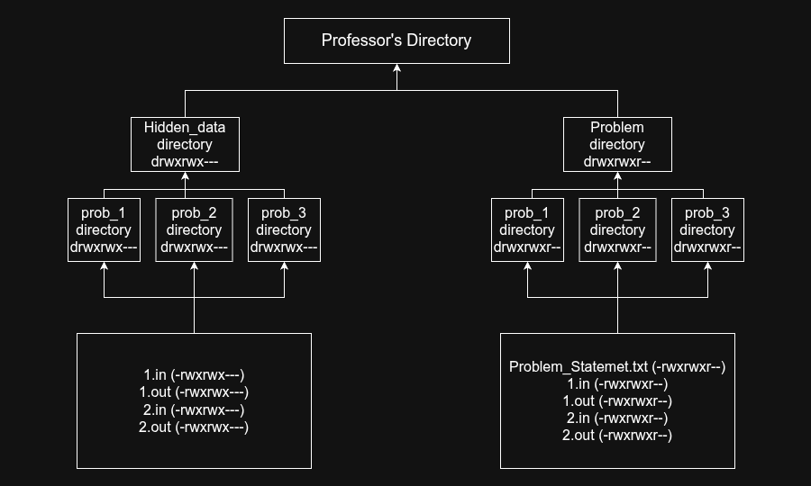

# Lab Judge System (LJS)
A high-performance, concurrent judge system built for programming labs and coding examinations. 

LJS provides a secure, structured, and multithreaded environment for compiling, running, and evaluating student submissions with minimal overhead. It utilizes a **Client-Server architecture** via UNIX domain sockets and relies on IOI's `isolate` sandbox for strict process isolation and resource control.

## Features
* **Client-Server Architecture** - A persistent background server daemon (`LJS_server`) handles connections from lightweight CLI clients (`LJS_client`).
* **Concurrent Submission Handling** - Fully thread-safe judging using a custom-built thread pool and thread-safe queue. Multiple submissions are processed simultaneously without blocking.
* **Run Mode** - Test solutions against public example test cases.
* **Submit Mode** - Evaluate solutions against hidden test cases.
* **Secure Sandboxed Execution** - Uses IOI's `isolate` sandbox to strictly limit memory, execution time, and system access.
* **Structured File Permission Model** - Ensures secure test case isolation between the judge and users.
* **Minimal Runtime Overhead** - Focused purely on systems-level C++ performance.

(Note: The `custom_run` feature has been deprecated in favor of streamlined standard run/submit pipelines).*

## Architecture & Directory Structure

LJS separates its codebase from the professor-side lab configuration. 

### 1. Repository Layout
The source code is structured using standard C++ practices:
```text
LJS/
├── .gitignore     
├── README.md     
├── src/                     # Implementation files
│   ├── LJS_server.cpp       # Main server daemon
│   ├── LJS_client.cpp       # CLI client
│   ├── isolate_utils.cpp    # Sandboxing logic
│   └── process_utils.cpp    # Forking and compilation
├── include/                 # Header files and interfaces
│   ├── function_wrapper.hpp
│   ├── isolate_utils.hpp
│   ├── judge.hpp
│   ├── process_utils.hpp
│   ├── socket.hpp
│   ├── threadpool.hpp       # Custom thread pool
│   └── threadsafe_queue.hpp # Thread-safe job queue
├── tests/                   # Concurrent stress tests
└── assets/                  # Documentation images
```

### 2. Lab Filesystem Layout (Professor-Side)
The following diagram shows the expected filesystem layout for configuring labs, including directory hierarchy and file permission organization.



### Filesystem Layout Overview
- ```Problem/``` Directory
    - Contains all problems for a lab.
    - ```prob_x/``` Directory
        - individual problem directory which contains:
            - Problem Statement
            - Example Test Cases (`.in` and `.ans` files)
- ```Hidden_data``` Directory
    - Contains data which should only be accessible to authorized users and the judge process.
    - ```Hidden Test Case``` Directory
        - Contains hidden test cases 

## Usage
Because LJS now uses a client-server model, you must have the server running before submitting code.

### 1. Start the Judge Server
Run the server daemon. It will listen for incoming UNIX socket connections.

```bash
./LJS_server
```
### 2. Run a Solution (Client)
In a separate terminal, test a solution against the public example test cases.

```bash
./LJS_client run <lab number> <problem number> <solution file.cpp>
# Example: ./LJS_client run 1 1 prob_1.cpp
```
### 3. Submit a Solution (Client)
Submit the solution for formal evaluation against all test cases.

```bash
LJS submit <lab number> <problem number> <solution file.cpp>
```

## Tech Stack

- Language: C++17

- Compiler: g++

- Concurrency: `std::thread`, `std::mutex`, `std::condition_variable` (Custom Thread Pool)

- Networking/IPC: POSIX UNIX Domain Sockets (AF_UNIX)

- Process Management: `fork()`, `execv()`, `waitpid()`, `dup2()`  

- Sandboxing: [IOI isolate](https://github.com/ioi/isolate)

- Platform: Linux

## Planned Improvements
- **Config-driven setup:** Easier environment initialization.
- **Database Integration:** Persistent submissions database to replace live-socket-only feedback.
- **Detailed verdict logs:** Better analytics and output tracing.

## Known Issues
- Some execution paths currently lack proper timeout safeguards (like compilation).
- Certain environment paths (like `/usr/local/bin/isolate` and `/usr/bin/g++`) are currently hardcoded.

## Motivation
Programming labs often rely on manual evaluation or heavyweight, bloated online judge systems. LJS aims to provide a lightweight, blazingly fast, and locally deployable alternative specifically optimized for the concurrency and security needs of academic lab environments.

## Future Vision
The long-term goal of LJS is to evolve into a fully scalable programming lab platform with features like:
- Live student Leaderboard
- Live monitoring and analytics
- Plagiarism Detector
- Integrated feedback mechanisms to aid the learning journey of students.