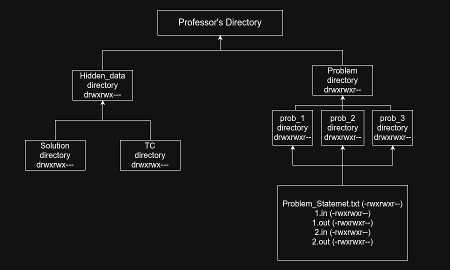

# Lab Judge System (LJS)
A high-performance judge system built for programming labs and coding examinations.
LJS provides a secure, structured, and concurrent environment for compiling, running, and evaluating student submissions with minimal overhead.

## Features
* __Run Mode__ - Test solutions against public example test cases.
* __Custom Run__ - Execute solutions on custom user-provided input.
* __Submit Mode__ - Evaluate solutions against hidden test cases.
* __Sandboxed Execution Environment__.
* __Configurable Constraints__ (in progress):
    * Time Limits
    * Memory Limits
    * Directory Paths
    * Language/Compiler Settings.
* __Concurrent Submission Handling__ (in progress).
* __Live Leaderboard__ (in progress).
* __Database Integration__ (in progress).
* __Structured File Permission Model__ for secure test case isolation.
* __Minimal Runtime Overhead__ focused on systems-level performance.

## Tech Stack
- __Language:__ C++
- __Compiler:__ g++
- __Core Concepts Used__
    - Process Management
    - File System Management
    - Concurrency
    - IPC/System Calls
    - Secure execution environment
    - Judge pipeline architecture

## Directory Strucuture for the Lab
The following diagram shows the expected filesystem layout for the professor-side lab configuration, including directory hierarchy and file permission organization.



## Filesystem Layout Overview
- ```Problem/``` Directory
    - Contains all problems for a lab.

## Usage
* Custom run
```bash
./LJS custom_run <solution file.cpp>
```
* Run
```bash
./LJS run <lab number> <problem number> <solution file.cpp>
```
* Submit
```bash
LJS submit <lab number> <problem number> <solution file.cpp>
```
## Known Bugs
* Race Conditions on multiple users.
* No timeouts safety in some parts.