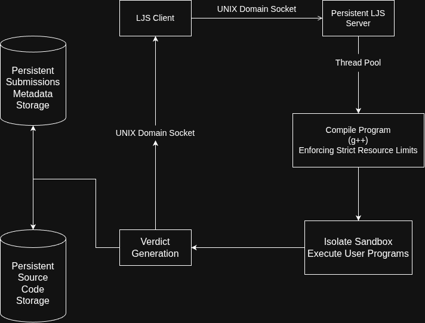

# Lab Judge System (LJS)
A high-performance, lightweight programming judge built in C++17 for programming labs and coding examinations.

LJS uses a persistent client-server architecture over UNIX domain sockets. Submissions are queued and processed concurrently by a custom thread pool, compiled with controlled resource limits, and executed inside an IOI's `isolate` sandbox. Submission metadata and source code are persisted using SQLite.

## Features
* **Persistent Client-Server Architecture** - A long-running `LJS_server` accepts requests from lightweight CLI clients over POSIX UNIX domain sockets.
* **Concurrent Submission Handling** - A custom thread pool and thread-safe queue process multiple submissions concurrently.
* **Secure Sandboxed Execution** - Uses IOI's `isolate` sandbox to strictly limit memory, execution time, and system access.
* **Resource Limits Enforced Compilation** - Limits CPU, Memory, wall-time and file size to prevent malicious code from crashing the server.
* **Server-Side Source Validation** - Client credentials are obtained through `SO_PEERCRED`; source paths are canonicalized and verified against the user's home directory and file ownership.
* **Run & Submit Modes** - Test against public examples with run, or evaluate against public and hidden tests with submit.
* **Persistent Submissions** - Test solutions against public example test cases.SQLite stores submission metadata including user, content-derived code ID, and final verdict.
* **Persistent Source Storage** - Submitted source files are stored independently of the user's original filesystem path.Test solutions against public example test cases.
* **Content-Derived Code IDs** - Source code is assigned a deterministic 128-bit content identifier using two independent 64-bit rolling hashes.
* **Reusable Sandbox IDs** - A thread-safe ID pool safely allocates and reclaims isolate sandbox IDs across concurrent jobs.
* **Automatic Cleanup** - Temporary binaries, sandbox environments, and execution artifacts are cleaned up after judging.
* **Config Driven environment setup** - Professors and Administrators can easily configure various environment variables and resource limits.
* **Robustness Testing** - Includes adversarial tests for resource exhaustion, malformed requests, path traversal, process termination, client disconnects, sandbox lifecycle, and concurrent load.

(Note: The `custom_run` feature has been deprecated in favor of streamlined standard run/submit pipelines).*

## Architecture

### Judging Pipeline
LJS separates request handling, concurrent scheduling, judging, sandboxed execution, and persistence into distinct components:




## Security Model

Security-sensitive validation is performed by the server rather than trusting the client.

1. The server obtains the connecting process credentials using `SO_PEERCRED`.

2. The client's UID is resolved to its system user and home directory.

3. The requested source path is canonicalized and verified to remain within that home directory.

4. File ownership is checked against the authenticated UID.

5. Only validated source files enter the judging pipeline.

6. Compilation and execution are performed under resource limits inside an isolate sandbox.

This prevents clients from submitting arbitrary filesystem paths or directly using the judge to execute unauthorized programs.

## Filesystem Layout

### Lab Configuration
The following diagram shows the expected filesystem layout for configuring labs, including directory hierarchy and file permission organization.


### Professor-Side Structure
- ```Problem/``` Directory
    - Contains all problems for a lab.
    - ```prob_x/``` Directory
        - individual problem directory which contains:
            - Problem Statement
            - Example Test Cases (`.in` and `.ans` files)
- ```Hidden_data``` Directory
    - Contains data which should only be accessible to authorized users and the judge process.
    - ```Hidden Test Case``` Directory
        - Contains hidden test cases 

## Robustness and Stress Testing

LJS includes an automated robustness suite covering:

- Resource exhaustion and compiler failures

- Malformed protocol requests and missing arguments

- Absolute/relative path traversal attempts

- Client disconnects during compilation and execution

- SIGKILL of sandboxed descendant processes

- Sandbox ID lifecycle and reuse

- Concurrent submission load with 100 simultaneous requests

- Post-test checks for leaked processes, threads, file descriptors, binaries, and sandbox state

The suite verifies not only verdict correctness but also process and resource cleanup after failures and adversarial workloads.


## Persistence

LJS persists completed submissions using SQLite.

Each submission records: user ID, code ID, and verdict.

Source code is stored separately using its content-derived code_id, allowing submission records to remain independent of the user's original source-file path.

The database schema is initialized automatically when the server starts, and SQLite's busy timeout provides basic contention handling for concurrent workers.


## Build
### Requirements
- Linux
- `g++` with C++17 support
- GNU Make
- [IOI isolate](https://github.com/ioi/isolate)

Build LJS with:
```bash
make
```

Delete/clean build artifacts with:
```bash
make clean
```

## Usage
Because LJS now uses a client-server model, you must have the server running before submitting code.

### 1. Start the Judge Server

Run the server daemon. It will listen for incoming UNIX socket connections.

```bash
./LJS
```
### 2. Run a Solution (Client)
In a separate terminal, test a solution against the public example test cases.

```bash
./client run <lab number> <problem number> <solution file.cpp>
# Example: ./client run 1 1 prob_1.cpp
```
### 3. Submit a Solution (Client)
Submit the solution for formal evaluation against all test cases.

```bash
./client submit <lab number> <problem number> <solution file.cpp>
```
The server must remain running while submissions are processed.

## Tech Stack

- Language: C++17

- Platform: Linux

- Build: GNU Make

- Concurrency: [Thread-Pool](https://github.com/FRANK-FY-RI/Thread-Pool) and [MPMC Concurrent Job Queue](https://github.com/FRANK-FY-RI/Concurrent-queues)

- Networking/IPC: POSIX UNIX Domain Sockets (AF_UNIX)

- Process Management: `fork()`, `exec*()`, `waitpid()`, `dup2()`  

- Sandboxing: [IOI isolate](https://github.com/ioi/isolate)

- Persistence: [SQLite3](https://github.com/sqlite/sqlite)

## Motivation
Academic programming labs need a judge that is lightweight enough to deploy locally while still providing process isolation, resource control, concurrent execution, and persistent submission records. LJS is designed around these requirements rather than the broader feature set of a general-purpose online judge.

## Future Vision
The long-term goal of LJS is to evolve into a fully scalable programming lab platform with features like:
- Live student Leaderboard
- Live monitoring and analytics
- Plagiarism Detector
- Integrated feedback mechanisms to aid the learning journey of students.
